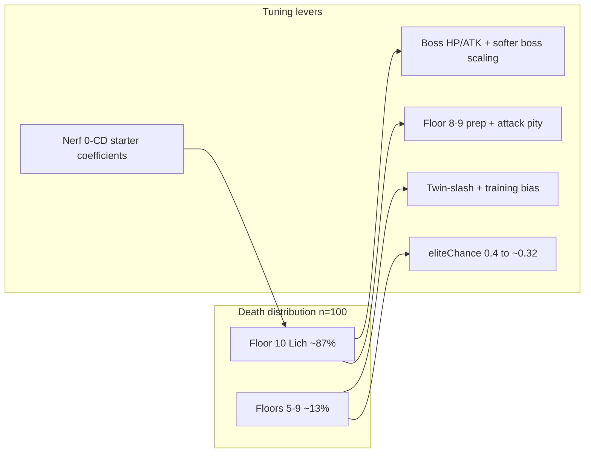

# Balance plan from 100-run autoplay insights

## Problem statement

Greedy autoplay reliably reaches **floor 10** (~84%) with **4–5 skills** but **0% wins**. Deaths cluster on the Lich (~330 scaled HP, ~28 ATK at floor 10 via [`Scaling.ts`](src/game/progression/Scaling.ts) + [`lich`](src/content/enemies/index.ts)). Secondary issues: **twin-daggers** under-learns attacks (~1.8 avg), **0-CD starters** out-DPS learned skills, **40% elite rate** from floor 6 drives ~16% pre-boss deaths, and **arcane-staff** reaches the boss with thinner builds than other kits.



**Success criteria (re-run after changes):**

```bash
npm run autoplay -- --runs 100 --policy greedy --seed 42
npm run autoplay -- --runs 50 --policy random --seed 42
```

| KPI | Current (greedy) | Target |
|-----|------------------|--------|
| Win rate | 0% | **10–25%** |
| Death at F10 | ~84% | **&lt;70%** (more wins + some mid-run) |
| Twin-daggers F10 reach | ~75% | **≥85%** |
| Greedy basic spam | ~81% | **&lt;75%** (relative; starters nerfed) |
| Runs with ≤1 attack (random) | ~34% | **&lt;20%** |

Do **not** change [`EncounterWeights.ts`](src/game/progression/EncounterWeights.ts) unless a follow-up batch still shows skill starvation.

---

## P0 — Floor-10 Lich (boss gate)

**Files:** [`src/content/enemies/index.ts`](src/content/enemies/index.ts), [`src/game/progression/Scaling.ts`](src/game/progression/Scaling.ts)

**1. Soften boss-only scaling** (keeps normal/elite curve intact)

Add dedicated multipliers used only by [`scaledBossStats`](src/game/progression/Scaling.ts) (called from [`EffectApplier.ts`](src/game/effects/EffectApplier.ts) when `isBoss`):

- Boss HP: use **~10% per floor** ramp instead of sharing `hpMultiplier`’s 12% post-floor-3 rate (floor 10: **2.0×** vs **2.2×** today).
- Optional cap: `bossHpMultiplier(floor) = min(hpMultiplier(floor), 1 + floor * 0.10)` if you want a single function.

**2. Trim Lich base stats** (content knob)

| Stat | Current | Proposed |
|------|---------|----------|
| `baseStats.maxHp` | 150 | **125** |
| `baseStats.attack` | 16 | **14** |

**Combined effect at floor 10 (approx.):** HP **330 → ~250**, ATK **28 → ~24** (before bursty 1.5× spikes in [`CombatEngine.ts`](src/game/combat/CombatEngine.ts) L232).

**3. Pre-boss prep on floors 8–9**

**Files:** [`src/game/progression/FloorGenerator.ts`](src/game/progression/FloorGenerator.ts), [`src/content/events/skill.ts`](src/content/events/skill.ts), [`src/game/progression/PacingRules.ts`](src/game/progression/PacingRules.ts)

Today floor 9 often offers only **one** choice (`getOptionCount` L46–48: 70% chance of 1 option). That hurts boss readiness.

- When `isBossFloor(floor + 1)` (floors **9** and **14**, …):
  - `getOptionCount` returns **at least 2** for that floor.
  - After options are rolled, if **no** `skill-training` option and `hasLearnableSkill(ctx)` (reuse check from [`skill.ts`](src/content/events/skill.ts)), **replace the lowest-weight non-heal slot** with a training option (keep enemy if it is the only combat path—prefer replacing shop/heal duplicate).

This gives greedy (and humans) a last chance to pick up a CD attack or upgrade before the forced boss floor.

---

## P0 — Twin-daggers kit

**Files:** [`src/content/skills/attacks/twin-daggers.ts`](src/content/skills/attacks/twin-daggers.ts), [`src/game/systems/SkillPool.ts`](src/game/systems/SkillPool.ts) or [`src/content/events/skill.ts`](src/content/events/skill.ts)

**1. Buff starter so the kit isn’t weakest at boss**

In `twinSlash` `onUse`:

- L1 damage mult **0.9 → 1.0**; L2 **1.05 → 1.1**; L3 **1.2 → 1.25**
- L1 bleed stacks **1 → 2** (L2+ stay 2) so bleed synergies matter earlier

**2. Attack pity in training** (all weapons; fixes rogue random underbuild)

Add `pickWeaponAttacks(ctx, count)` in [`SkillPool.ts`](src/game/systems/SkillPool.ts): uniform random among **unowned** attacks where `skill.weaponId === ctx.run.player.weaponId`.

In `buildTrainingChoices` ([`skill.ts`](src/content/events/skill.ts) L30–54):

- If `floor >= 4` and owned weapon attacks **&lt; 2**, ensure **at least one** weapon attack id is in the 3 choices (fill first slot from `pickWeaponAttacks(ctx, 1)` before generic `pickSkills`).

Each weapon has exactly **2** non-starter attacks, so this guarantees `shadow-step` / `flurry` show up reliably.

---

## P1 — Normalize 0-CD starter power (keep `baseCooldown: 0`)

**Rationale:** Starters should stay “always available” (UI primary button in [`mountCombatScreen.ts`](src/ui/screens/mountCombatScreen.ts)); **nerf coefficients** so CD skills compete. Avoid reverting to `baseCooldown: 1` unless a second autoplay pass still shows &gt;80% basic spam.

**Files:** all six under [`src/content/skills/attacks/`](src/content/skills/attacks/)

| Skill | Weapon | Change (L1 / L2 / L3 mult) |
|-------|--------|----------------------------|
| `crushing-blow` | warhammer | **1.4/1.65/1.9 → 1.15/1.35/1.55** |
| `crossbow-poison-dart` | hand-crossbow | **0.8/1.0/1.2 → 0.72/0.9/1.08** |
| `twin-slash` | twin-daggers | apply **buff above** (net slightly up vs pure nerf—kit-specific) |
| `staff-fireball` | arcane-staff | **1/1.25/1.5 → 0.85/1.1/1.35** spell mult; keep burn stacks |
| `sword-slash` | longsword | **1.0/1.15/1.3 → 0.9/1.05/1.2** |
| `arcane-bolt` | focus-wand | **1.1/1.3/1.5 → 0.95/1.15/1.35** |

Update matching `levelDescriptions` strings so glossary stays accurate.

**Optional follow-up:** slightly bump CD attack damage on warhammer / crossbow files if greedy still ignores them after starter nerfs (check `combatSkillScore` in [`skillScoring.ts`](src/game/autoplay/skillScoring.ts) only if needed).

---

## P1 — Mid-run spike (floors 6–8)

**File:** [`src/game/progression/Scaling.ts`](src/game/progression/Scaling.ts) — `eliteChanceForFloor`

| Floor | Current | Proposed |
|-------|---------|----------|
| 3–5 | 0.15 | **0.15** (unchanged) |
| 6+ | 0.40 | **0.32** |

This directly targets the ~13% deaths before F10 without flattening early floors.

---

## P2 — Arcane-staff overtune (boss with few skills)

Covered primarily by **staff-fireball** nerf (P1). If staff still tops win-less F10 reach with lowest skill count in the next batch, additionally:

- Reduce L1 burn on fireball from **1 → 0** stacks (damage-only L1), or
- Trim [`arcaneStaff`](src/content/weapons/index.ts) `statModifiers.spellPower` **8 → 6**

Prefer **skill-only** change first to avoid punishing focus-wand mage.

---

## P2 — Shop (gold not converting to power)

**Files:** [`src/content/shop/catalog.ts`](src/content/shop/catalog.ts), optionally [`src/game/autoplay/GreedyPolicy.ts`](src/game/autoplay/GreedyPolicy.ts) shop scoring

- `SHOP_SKILL_BASE_PRICE` **25 → 20** (greedy already buys ~1.3×/run; helps humans and random)
- No autoplay logic change required unless random still hoards gold; then bump skill row score in `scoreShopItem` when `attacks < 2`

---

## Verification workflow

1. `npm run build`
2. Greedy batch (primary balance probe): **100 runs**, fixed seed
3. Random batch: **50 runs**, same seed
4. Compare summaries to baseline [`summary-2026-06-04T07-50-16-872Z.json`](logs/autoplay/summary-2026-06-04T07-50-16-872Z.json) / random twin
5. Spot-check 2–3 `run-*.json` floor-10 losses: player HP at boss start, skill list, turn count
6. Update glossary copy only where skill numbers changed ([`GlossaryScreen.ts`](src/ui/screens/GlossaryScreen.ts) reads live defs—should auto-reflect)

**If win rate still 0% after P0+P1:** second pass — Lich **120 HP** base or boss bursty multiplier **1.5 → 1.35** in [`CombatEngine.ts`](src/game/combat/CombatEngine.ts).

**If win rate &gt;30%:** partially revert boss HP scaling only (keep pity + starter nerfs).

---

## Out of scope (this pass)

- Autoplay policy changes (greedy is already a good probe)
- Encounter weight changes
- New content / fourth dagger attack
- Profile meta or UI combat rework
